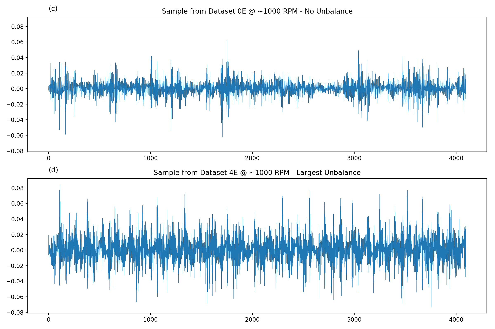
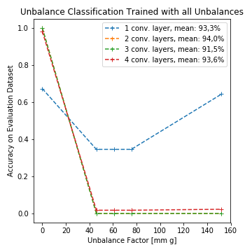
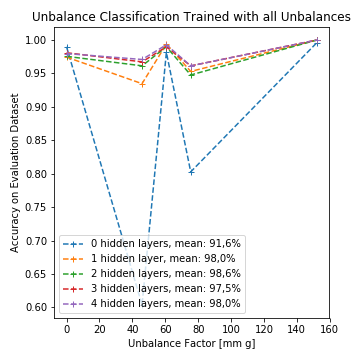

# Machine Learning Based Unbalance Detection of a Rotating Shaft Using Vibration Data
### Oliver Mey, Willi Neudeck, André Schneider and Olaf Enge-Rosenblatt
##### Fraunhofer IIS/EAS, Fraunhofer Institute for Integrated Circuits, Division Engineering of Adaptive Systems, Dresden, Germany

This GitHub repository is part of a paper submission to the **25th IEEE International Conference on Emerging Technologies and Factory Automation, ETFA 2020**. It contains a series five freely available Python Jupyter notebooks with code examples. The code was used to get the classifications results described within the ETFA paper. The dataset used for the
detection of unbalances based on vibration data along with this study is available via the Fraunhofer Fordatis database (https://fordatis.fraunhofer.de/handle/fordatis/151.2). Both, the Python code and the data, allow all interested engineers, data scientists, and Machine Learning / Deep Learning / AI freaks to check the classification results described in the IEEE paper and to supplement their own analyzes. We look forward to your comments and suggestions for improvements.

Data from vibration sensor 1 for a complete measurement for the case of no unbalance and the largest
unbalance.

For both cases, also a one second sample is extracted.

The FFT transformation of the a measurement cycle.

 

Classification results for different unbalance cases (left: raw vibrations/timeseries signals with convolutional neural network, right: FFT-transformed vibrations signals with fully-connected neural network).
